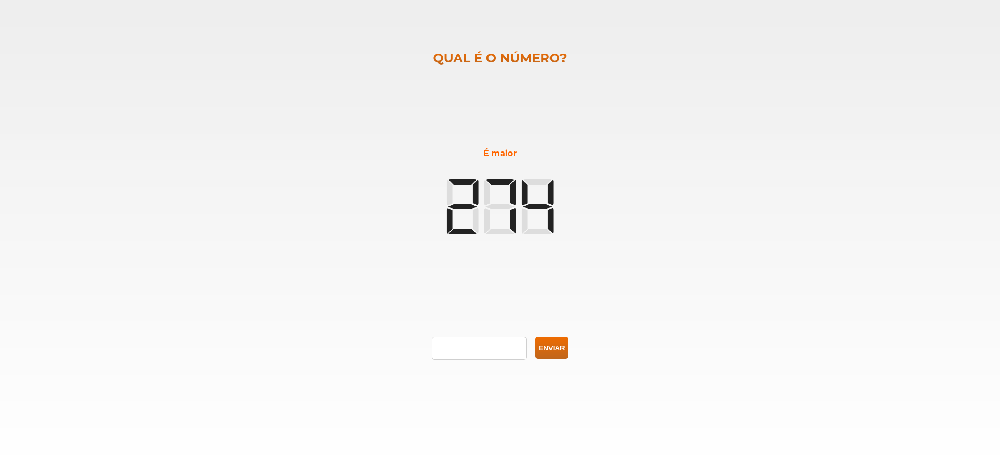

<div id="top"></div>

[![Issues][issues-shield]][issues-url]
[![MIT License][license-shield]][license-url]
[![LinkedIn][linkedin-shield]][linkedin-url]


<br />
<div align="center">
  <a href="https://github.com/heflerdev/studio-sol-application">
    
  </a>

  <h3 align="center">Studio Sol - Frontend Challenge</h3>

  <p align="center">
    A small game that generates a number and you have to guess it.
    <br />
    <a href="https://studio-sol-heflerdev.netlify.app/"><strong>View Demo »</strong></a>
    <br />
    <br />
    <a href="https://github.com/HeflerDev/Studio-Sol-Application/issues">Report Bug</a>
    ·
    <a href="https://github.com/HeflerDev/Studio-Sol-Application/issues">Request Feature</a>
  </p>
</div>

<details>
  <summary>Table of Contents</summary>
  <ol>
    <li>
      <a href="#about-the-project">About The Project</a>
      <ul>
        <li><a href="#built-with">Built With</a></li>
      </ul>
    </li>
    <li>
      <a href="#getting-started">Getting Started</a>
      <ul>
        <li><a href="#prerequisites">Prerequisites</a></li>
        <li><a href="#installation">Installation</a></li>
      </ul>
    </li>
    <li><a href="#usage">Usage</a></li>
    <li><a href="#roadmap">Roadmap</a></li>
    <li><a href="#contributing">Contributing</a></li>
    <li><a href="#license">License</a></li>
    <li><a href="#contact">Contact</a></li>
    <li><a href="#acknowledgments">Acknowledgments</a></li>
  </ol>
</details>

## About The Project



This project is a step of an application process to work at "Studio Sol", wich consists in creating a number-guessing webapp without the use of any library - excluding bundlers -.

<p align="right">(<a href="#top">back to top</a>)</p>

### Built With

* HTML
* CSS
* JavaScript
* [Webpack](https://webpack.js.org/)
* [Jest](https://jestjs.io/)

<p align="right">(<a href="#top">back to top</a>)</p>

## Getting Started

The installing process is fairly simple, since doesn't need any API key or aditional configuration (other than have NPM).

### Prerequisites

* npm
  ```sh
  npm install npm@latest -g
  ```

### Installation

1. Clone the repo
   ```sh
   git clone git@github.com:HeflerDev/Studio-Sol-Application.git
   ```
3. Install NPM packages
   ```sh
   npm install
   ```

<p align="right">(<a href="#top">back to top</a>)</p>

## Usage

### Project Structure

The project uses the Webpack bundler to produce a build, so is recommended to **ONLY** code in the *src/* folder.
Usually I don't think this section is necessary on README, but since I'm being evaluated, it's a good way to talk about my code.

* **src/** - The source folder
  * **assets/** - All the application assets (images, icons...)
  * **components/** - The HTML components, each one separate by a functionality.
  * **scripts/** - (almost)All the JavaScript files.
  * **styles/** - All the CSS files.
  * **index.js** - The entry point of the application.

* **scripts/**
  * **helpers/** - Auxiliary code (handle data and render)
  * **listeners/** - Listeners and calls (button clicks and form filling)
  * **services/** - All api callings
  * **store/** - The store that handle application state.
  
 ### Project Architecture
 
 Bellow there is a graphic that pretty much explains the logic of the architecture.
 The details of the logic and architecture are commented on the code itself.
 
 <details>
 <summary>VIEW THE GRAPHIC</summary>
 
 </details>
 
## Roadmap

- [x] Should render "ERROR" when application crashes
- [x] Should render "É menor" when the guess is higher than the sorted number.
- [x] Should render "É maior" when the guess is lower than the sorted number.
- [x] Should render "Você acertou!!!!" when the guess is exactly the sorted number. 
- [x] Should render new game button when:
  - [x] An ERROR occurs.
  - [x] The player finishes the game (guess right).
- [x] Optional
  - [x] Use Bundler
  - [x] Unit testing

See the [open issues](https://github.com/HeflerDev/Studio-Sol-Application/issues) for a full list of proposed features (and known issues).

<p align="right">(<a href="#top">back to top</a>)</p>

## Contributing

Contributions are what make the open source community such an amazing place to learn, inspire, and create. Any contributions you make is **greatly appreciated**.

If you have a suggestion that would make this better, please fork the repo and create a pull request.
Don't forget to give the project a star!

1. Fork the Project
2. Create your Feature Branch (`git checkout -b feature/AmazingFeature`)
3. Commit your Changes (`git commit -m 'Add some AmazingFeature'`)
4. Push to the Branch (`git push origin feature/AmazingFeature`)
5. Open a Pull Request

<p align="right">(<a href="#top">back to top</a>)</p>

## License

Distributed under the MIT License. See `LICENSE.txt` for more information.

<p align="right">(<a href="#top">back to top</a>)</p>

## Contact

Hefler - [@heflerdev](https://www.instagram.com/heflerdev/) - heflerdev@gmail.com

<p align="right">(<a href="#top">back to top</a>)</p>

[issues-shield]: https://img.shields.io/github/issues/heflerdev/Studio-Sol-Application.svg?style=for-the-badge
[issues-url]: https://github.com/HeflerDev/Studio-Sol-Application/issues
[license-shield]: https://img.shields.io/github/license/heflerdev/studio-sol-application.svg?style=for-the-badge
[license-url]: https://github.com/heflerdev/studio-sol-application/LICENSE.txt
[linkedin-shield]: https://img.shields.io/badge/-LinkedIn-default.svg?style=for-the-badge&logo=linkedin&colorB=blue
[linkedin-url]: https://linkedin.com/in/heflerdev
[product-screenshot]: images/screenshot.png
